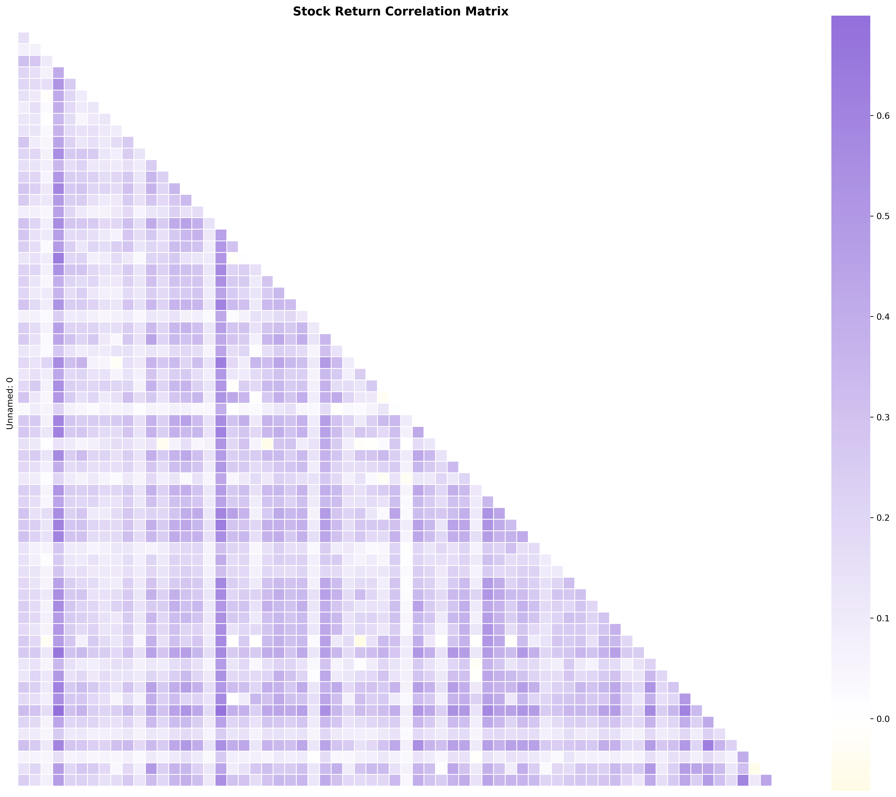
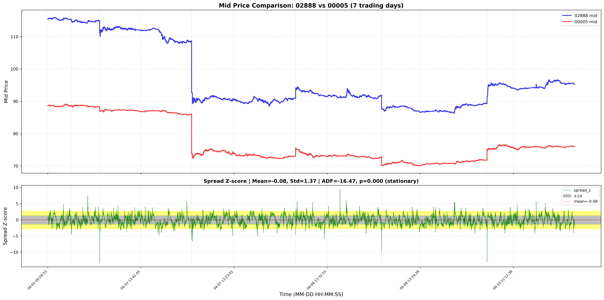
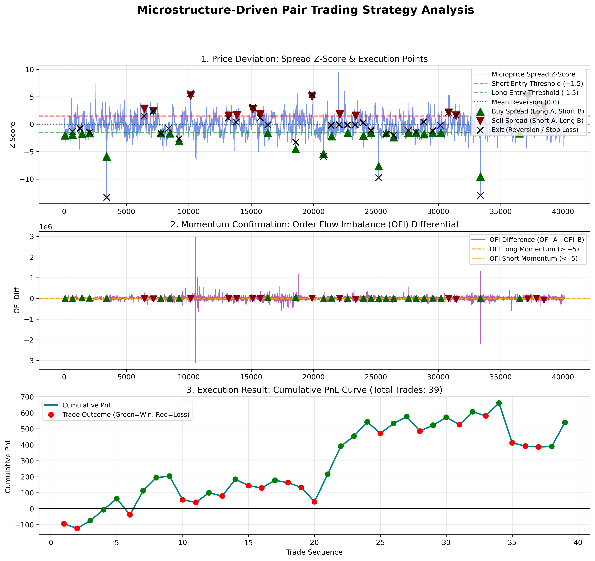

# Pair-HF-trading-in-simple-framework
A lightweight pair trading system for high-frequency statistical arbitrage using L2 data. Implements correlation screening, cointegration testing, and execution with real-time risk controls. 
Keys: Correlation Screening​ → Cointegration Validation​ → Hedged Execution​ → Performance Analysis 

**Pair Selection Protocol**
* Step 1: Correlation​ - Filter for high positive correlation (>0.6) to ensure directional alignment
<small>
  
| TOP 5 Highest Positive Correlations | TOP 5 Highest Negative Correlations | TOP 5 Weakest Correlations |
| :--- | :--- | :--- |
| 1. 02888 - 00005: +0.6992 | 1. 09618 - 09868: -0.0718 | 1. 01299 - 09868: -0.0005 |
| 2. 01729 - 00005: +0.6792 | 2. 01929 - 01299: -0.0587 | 2. 01810 - 09992: +0.0011 |
| 3. 02888 - 00700: +0.6654 | 3. 00340 - 09898: -0.0582 | 3. 00939 - 01530: +0.0011 |
| 4. 02888 - 09999: +0.6334 | 4. 01093 - 01299: -0.0357 | 4. 01810 - 09868: -0.0017 |
| 5. 01729 - 02899: +0.6262 | 5. 01398 - 06181: -0.0306 | 5. 06181 - 09868: -0.0022 |
</small>

* Step 2: Cointegration​ - ADF test on spread_z (p<0.05) to confirm mean-reverting equilibrium

**Dynamic Hedging**
* Model: mid_A = β × mid_B + α(α≈0)
* Calculation: Rolling 600-tick OLS: β = cov(mid_A, mid_B)/var(mid_B)
* Execution Prices:
  Stock A: bid_A/ask_A 
  Stock B: bid_B×β/ask_B×β 

## main.py
Complete pair trading workflow example. Demonstrates end-to-end statistical arbitrage implementation. 
<small>

| No. | Step | Function | Purpose |
| :--- | :--- | :--- | :--- |
| 1 | Data Alignment | `align_two_files()` | Align time series of two stocks |
| 2 | Sorting Check | `sort_values('timestamp')` | Ensure chronological order  |
| 3 | Beta Calculation | `calculate_rolling_hedge_ratio_fast()` | Compute dynamic hedge ratio |
| 4 | Hedged Prices | `calculate_trade_prices_with_hedge()` | Adjust prices for hedging |
| 5 | Signal Generation | `generate_pair_signals()` | Generate trading signals |
| 6 | Backtesting | `backtest_pair_cross_spread()` | Execute and measure performance |
| 7 | Analysis | `plot_strategy_analysis()` | Visualize results |
</small>

## data_processing.py
Core data processing and L2 tick data loading module. Handles Level 2 data loading, cleaning, and basic feature engineering. 

*Core Functions*
* _read_csv()​ - Robust CSV loading with multiple encodings (UTF-8, GBK, GB18030)
* load_l2_ticks()​ - Load and parse L2 CSV data, groups by timestamp for deduplication
* load_all()​ - Load multiple trading days
* clean_price_anomalies()​ - Remove price jumps (>20%), removes first and last 60 ticks (pre/post market)
* infer_missing_sides_with_lee_ready()​ - Lee-Ready algorithm for side inference
* add_l2_and_orderflow_features()​ - Create L2 and order flow features

### Feature Engineering
<small>
  
| Category | Features | Description |
|---|---|---|
| Basic | mid, spread, microprice | Mid-price, bid-ask spread, size-weighted price |
| Order Flow | signed_vol, ofi_l1, ofi_l1_roll | Order flow imbalance metrics |
| Market Depth | bid_depth, ask_depth, depth_imbalance | L1-L5 depth and imbalance |
</small>

## pair_trade_strategy.py
*Core Functions*
* align_two_files()​ - Align two stock time series and statistical arbitrage with z-score
* generate_pair_signals()​ - Generate pair trading signals by order flow and depth imbalance
* backtest_pair_cross_spread()​ - Backtest pair strategy with rolling hedge ratio calculation with risk management (stop-loss, max hold time) and then get 15+ performance statistics.
* calculate_rolling_hedge_ratio_fast()​ - Dynamic hedge ratio
* calculate_trade_prices_with_hedge()​ - Compute hedged prices

### Trading Strategy Logic
<small>
  
| Step | Action | Logic |
|------|--------|-------|
| 1. Signal Generation | Entry: `spread_z > ±1.5` + `ofi_diff` confirmation | Cointegration deviation + order flow |
| 2. Risk Management | Min hold: 600 ticks, Max hold: 3000 ticks | Prevent overtrading |
| 3. Exit Conditions | Spread reverts, stop-loss, or timeout | Multi-condition exits |
| 4. Dynamic Hedging | Rolling 300-tick hedge ratio | Covariance-based hedging |
</small>

### Trading Positions
<small>
  
| Position | Action | Condition |
|---|---|---|
| Long Pair (+1) | Buy A, Sell B | `spread_z < -1.5` + `ofi_diff > 5` |
| Short Pair (-1) | Sell A, Buy B | `spread_z > 1.5` + `ofi_diff < -5` |
</small>

## pair_analyse.py
Pair analysis and visualization module. Computes stock correlations, identifies trading pairs, and visualizes relationships. 

*Core Functions*
* calculate_pair_correlation_simple()​ - Pairwise correlation
* calculate_correlation_matrix_simple()​ - Full correlation matrix
* plot_simple_correlation_heatmap()​ - Heatmap visualization
* print_top_correlations_from_matrix()​ - Top correlation pairs
* plot_pair_mid_price_with_spread()​ - Price + Cointegration analysis of spread by Stationarity testing (ADF)
* remove_stock_from_correlation_matrix()​ - Matrix editing

*Data Output*
* CSV files: Correlation matrices
* PNG images: Heatmaps, comparison charts
* Console reports: Top correlation pairs
* Statistical tests: ADF stationarity results

